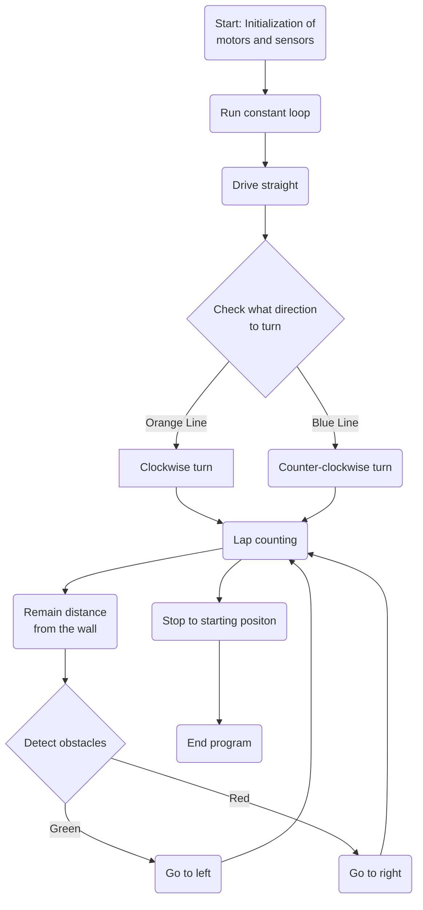

# 🤖 *PRO 2025* | **Project Namnama**

### *Engineering the future, driven by hope* — we are Team B of PCLU SiribTech Future Engineers.

# Lists of Contents
- [1. Introduction](#1-introduction)
    - [1.1 About Us](#11-about-us)
    - [1.2 Team Management](#12-team-management)
    - [1.3 Reasons to Participate](#13-reasons-to-participate)

# 1. Introduction   
## 1.1 About Us

    </img>
    <h3 align="center"> Team's name: <i><b>SiribTech</b></i> | Car's name: <i><b>Namnama</b></i> | Match Name: <b><i>A Self-Driving Car Challenge</i></b> </h3>

| Name | Age | Role | Socials | Fun facts: |
| :---: | :---: | :---: | :---: | :--- |
| Aliana Marie L. Marquez | 16 | Robot Builder and Prototyper |  <a href="https://facebook.com/aliana.marquez.165" target="_blank">@aliana.marquez.165</a> | A hobby that I enjoy doing the most is sketching during my free time or whenever I am bored. I also like to entertain myself sometimes by playing online games. |
| John Kenneth P. Valbuena | 16 | Robot Programmer and Technical Writer | <a href="https://facebook.com/kntheen04" target="_blank">@kntheen04</a> | I play sports. One of my most cherished sport is Volleyball. I spend most of my time on my computer since I am very interested in ICT. |
| Kryztal Gale R. Rivera | 15 | Robot Builder and Technical Writer | <a href="https://facebook.com/cryztkjlr" target="_blank">@cryztkjlr</a> | I sing, I write, and in my free time/days, I play badminton. I am fascinated about exploring and diving into new stuff. |

## 1.2 Team Management
With curious minds, small steps fueled by creativity and teamwork, our project is the result of our team's joint endeavor. As students from <a href="https://facebook.com/PCLUBasicEducationDepartment" target="_blank"><b>Polytechnic College of La Union (PCLU)</b></a> representing the Robotics Club in the category of Future Engineers, we applied our knowledge and skills in designing, building and programming a robot that emphasizes on creating innovative robot solutions. Throughout this journey, we learned the importance of perseverance and considering our own capabilities in doing such tasks to create a successful project.  
Team Supervisor: **Kryztal Gale R. Rivera** 
Team Coach: **Bong John Abraham Agno** & **Michael James Estipular Ergino**

## 1.3 Reasons to Participate
For us, this project is more than just fighting for an honorable spot in the world of Robotics. It is more than just a competition. Here, we've indulged ourselves in discovering our fullest potentials by taking little steps and moving onto greater heights with full confidence and by enjoying the flow of the process. We've created a robot knowing it'll soon serve its purpose in the future.  Being a part of this Olympiad made us realize how great it is to seek answers or solutions for worldwide problems. The process also helped us realize how we should manage our talents/skills in the scope of Robotics. It is truly fascinating how a person can discover—such things about themselves while trying to discover for other people too.

# 2. Abstract / About the Car
## 2.1 Logic / Idea of the Car
This approach is applicable for managing both challenges and can be effectively implemented to find comprehensive solutions for each. 
 
1. The process begins when the "start" or "on" button is pressed to enable the function of the robot loading its pre-programmed instructions. In accordance with the program, it tells which way the robot goes; clockwise or counter-clockwise. This directional command guides the robot's navigation system, allowing it to orient itself correctly within its environment.
2. Once engaged, its driving motors then function as it moves forward creating a guiding path or the robot to go either in a clockwise or a counter-clockwise manner. 
3. During the obstacle challenge, different types of obstacles are expected. Literally, these are the obstacles that must be avoided during the whole laps or the lines with colors indicating one route at some point on the mat. That is why there are sensors and a camera attached onto the robot.
4. Some sensors and a camera are both placed on the robot to serve their specific purposes. The color sensor helps with lap detection. The ultrasonic sensors help with wall detection and avoidance. Lastly, the camera helps with obstacle detection and avoidance.
5. After the designated program has officially finished, the robot will stop. 
On the open challenge, this only happens when the robot has already done its full three (3) laps. On the other hand, this only happens on the obstacle challenge when the robot has also done its full three (3) laps while also successfully avoiding the obstacles (traffic signs). 

## 2.2 Flow Diagram
> [!NOTE]
> For a comprehensive overview of the system’s configuration, including open and obstacle diagrams, wiring diagrams, and schematic representations, please refer to the contents of the [schemes](/schemes/) directory.

## 2.3 Why LEGO MINDSTORMS EV3?

The LEGO MINDSTORMS EV3 is a programmable robotics kit that combines the versatility of LEGO building blocks with advanced technology to allow users to design, build, and program their own functional robots. It is the third-generation edition of the LEGO Mindstorms product line, succeeding the NXT and NXT 2.0. We used it for the following advantages:

- **Intelligent Core**: The EV3's programmable brick acts as its very brain. This compact computer is easy to set up and program, making it suitable and excellent for rapid creation of robotic movements, the quick demonstration of design concepts, and the efficient execution of complex operations, such as analyzing sensor input and coordinating multiple motor outputs. 
- **Intuitive Programming Environment**: The EV3 features a user-friendly, icon-based graphical programming interface. This drag-and-drop system allows for efficient work and rapid development of advanced functionalities without needing to write complex code from scratch. It also supports more advanced programming options for experienced users. 
- **Direct Hardware Control**: With its array of motors and sensors (color, ultrasonic, camera), the EV3 provides direct and precise control over physical actions and allows robots to perceive their environment. This enables the creation of responsive and autonomous machines. 
- **Versatility and Educational Impact**: The EV3 can be used to build a vast range of robots and mechanisms, from simple vehicles to complex robotic arms. It's commonly used in educational settings worldwide to teach STEM concepts, fostering creativity, critical thinking, problem-solving, and collaboration through engaging, hands-on robotics project.
