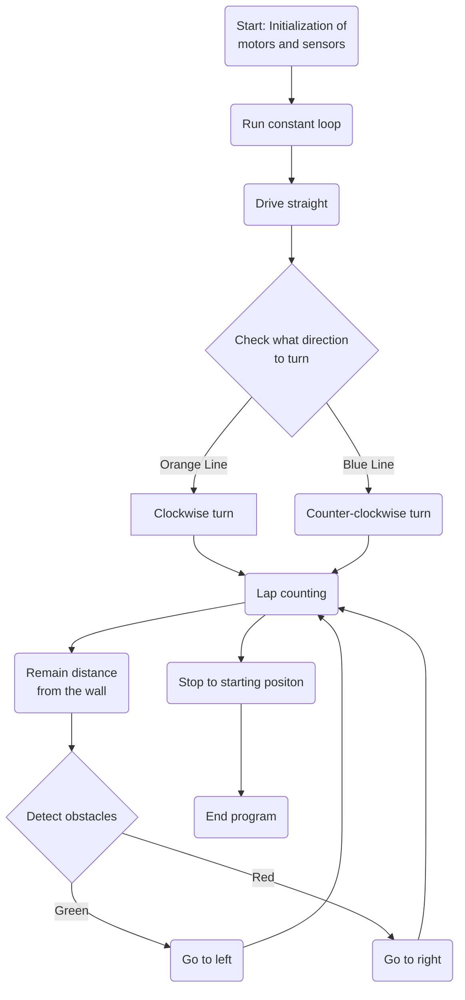

# 🤖 *PRO 2025* | **Project Namnama**

### *Engineering the future, driven by hope* — we are Team B of PCLU SiribTech Future Engineers.

# Lists of Contents
- [1. Introduction](#1-introduction)
    - [1.1 About Us](#11-about-us)
    - [1.2 Team Management](#12-team-management)
    - [1.3 Reasons to Participate](#13-reasons-to-participate)
- [2. Abstract / About the Car](#2-abstract--about-the-car)
    - [2.1 Logic / Idea of the Car](#21-logic--idea-of-the-car)
    - [2.2 Flow Diagram](#22-flow-diagram)
    - [2.3 Why LEGO MINDSTORMS EV3?](#23-why-lego-mindstorms-ev3)
- [3. Mobility Management](#3-mobility-management)
    - [3.1 Bill of Materials (BOM)](#31-bill-of-materials-bom)
    - [3.2 Wiring Diagram](#32-wiring-diagram)
    - [3.3 Rack and Pinion Steering Mechanism](#33-rack-and-pinion-steering-mechanism)
- [4. Power and Sense Management](#4-power-and-sense-management)
    - [4.1 Power Source](#41-power-source)
    - [4.2 Sensors](#42-sensors)
        - [4.2.1 EV3 Color Sensor](#421-ev3-color-sensor)
        - [4.2.2 EV3 Ultrasonic Sensor](#422-ev3-ultrasonic-sensor)
- [5. Open and Obstacle Management](#5-open-and-obstacle-management)
    - [5.1 Open Challenge](#51-open-challenge)
    - [5.2 Obstable Challenge](#52-obstacle-challenge)
- [6. Team and Vehicle Pictures](#6-team-and-vehicle-pictures)
- [7. Performance Videos](#7-performance-videos)

# 1. Introduction   
## 1.1 About Us

<div align="center">
    </img>
    <h3 align="center"> Team's name: <i><b>SiribTech</b></i> | Car's name: <i><b>Namnama</b></i> | Match Name: <b><i>A Self-Driving Car Challenge</i></b> </h3>
</div>

| Name | Age | Role | Socials | Fun facts: |
| :---: | :---: | :---: | :---: | :--- |
| Aliana Marie L. Marquez | 16 | Robot Builder and Prototyper |  <a href="https://facebook.com/aliana.marquez.165" target="_blank">@aliana.marquez.165</a> | A hobby that I enjoy doing the most is sketching during my free time or whenever I am bored. I also like to entertain myself sometimes by playing online games. |
| John Kenneth P. Valbuena | 16 | Robot Programmer and Technical Writer | <a href="https://facebook.com/kntheen04" target="_blank">@kntheen04</a> | I play sports. One of my most cherished sport is Volleyball. I spend most of my time on my computer since I am very interested in ICT. |
| Kryztal Gale R. Rivera | 15 | Robot Builder and Technical Writer | <a href="https://facebook.com/cryztkjlr" target="_blank">@cryztkjlr</a> | I sing, I write, and in my free time/days, I play badminton. I am fascinated about exploring and diving into new stuff. |

## 1.2 Team Management
With curious minds, small steps fueled by creativity and teamwork, our project is the result of our team's joint endeavor. As students from <a href="https://facebook.com/PCLUBasicEducationDepartment" target="_blank"><b>Polytechnic College of La Union (PCLU)</b></a> representing the Robotics Club in the category of Future Engineers, we applied our knowledge and skills in designing, building and programming a robot that emphasizes on creating innovative robot solutions. Throughout this journey, we learned the importance of perseverance and considering our own capabilities in doing such tasks to create a successful project.<br><br>
Team Supervisor: **Kryztal Gale R. Rivera**<br>
Team Coach: **Bong John Abraham Agno** & **Michael James Estipular Ergino**

## 1.3 Reasons to Participate
For us, this project is more than just fighting for an honorable spot in the world of Robotics. It is more than just a competition. Here, we've indulged ourselves in discovering our fullest potentials by taking little steps and moving onto greater heights with full confidence and by enjoying the flow of the process. We've created a robot knowing it'll soon serve its purpose in the future.<br><br>Being a part of this Olympiad made us realize how great it is to seek answers or solutions for worldwide problems. The process also helped us realize how we should manage our talents/skills in the scope of Robotics. It is truly fascinating how a person can discover—such things about themselves while trying to discover for other people too.

# 2. Abstract / About the Car
## 2.1 Logic / Idea of the Car
This approach is applicable for managing both challenges and can be effectively implemented to find comprehensive solutions for each. 
 
1. The process begins when the "start" or "on" button is pressed to enable the function of the robot loading its pre-programmed instructions. In accordance with the program, it tells which way the robot goes; clockwise or counter-clockwise. This directional command guides the robot's navigation system, allowing it to orient itself correctly within its environment.
2. Once engaged, its driving motors then function as it moves forward creating a guiding path or the robot to go either in a clockwise or a counter-clockwise manner. 
3. During the obstacle challenge, different types of obstacles are expected. Literally, these are the obstacles that must be avoided during the whole laps or the lines with colors indicating one route at some point on the mat. That is why there are sensors attached onto the robot.
4. Sensors are placed on the robot to serve their specific purposes. The color sensor helps with lap detection while the ultrasonic sensors help with wall detection and avoidance. 
5. After the designated program has officially finished, the robot will stop. 
On the open challenge, this only happens when the robot has already done its full three (3) laps. On the other hand, this only happens on the obstacle challenge when the robot has also done its full three (3) laps while also successfully avoiding the obstacles (traffic signs). 

## 2.2 Flow Diagram
> [!NOTE]
> For a comprehensive overview of the system’s configuration, including open and obstacle diagrams, wiring diagrams, and schematic representations, please refer to the contents of the [schemes](/schemes/) directory.




## 2.3 Why LEGO MINDSTORMS EV3?
<p align="center">The LEGO MINDSTORMS EV3 is a programmable robotics kit that combines the versatility of LEGO building blocks with advanced technology to allow users to design, build, and program their own functional robots. It is the third-generation edition of the LEGO Mindstorms product line, succeeding the NXT and NXT 2.0. We used it for the following advantages:</p>

- **Intelligent Core**: The EV3's programmable brick acts as its very brain. This compact computer is easy to set up and program, making it suitable and excellent for rapid creation of robotic movements, the quick demonstration of design concepts, and the efficient execution of complex operations, such as analyzing sensor input and coordinating multiple motor outputs.<br>
- **Intuitive Programming Environment**: The EV3 features a user-friendly, icon-based graphical programming interface. This drag-and-drop system allows for efficient work and rapid development of advanced functionalities without needing to write complex code from scratch. It also supports more advanced programming options for experienced users.<br>
- **Direct Hardware Control**: With its array of motors and sensors (color, ultrasonic, camera), the EV3 provides direct and precise control over physical actions and allows robots to perceive their environment. This enables the creation of responsive and autonomous machines.<br>
- **Versatility and Educational Impact**: The EV3 can be used to build a vast range of robots and mechanisms, from simple vehicles to complex robotic arms. It's commonly used in educational settings worldwide to teach STEM concepts, fostering creativity, critical thinking, problem-solving, and collaboration through engaging, hands-on robotics project.

# 3. Mobility Management
## 3.1 Bill of Materials (BOM)

| Quantity | Material | Description |
| :---: | :---: | :--- |
| 1 | EV3 Intelligent Brick | A programmable central control unit of the *LEGO MINDSTORMS EV3 Core Set.* It is used to control motors and read sensor inputs. |
| 1 | EV3 Rechargeable DC Battery | The main power source to operate our robot. |
| 1 | EV3 Color Sensor |  A sensor that detects color and light intensity, it senses orange (*as yellow*). |
| 2 | EV3 Ultrasonic Sensor | The sensors that emits high-frequency sound waves to calculate the distance between the sensor and the object/wall. |
| 2 | EV3 Medium Motor | The motors used for driving and steering mechanisms. |
| 5 | EV3 Cables | The cables to connect the 2 EV3 motors and 3 EV3 sensors to the *EV3 Intelligent Brick*. |

## 3.2 Wiring Diagram
> [!NOTE]
> For a comprehensive overview of the system’s configuration, including open and obstacle diagrams, wiring diagrams, and schematic representations, please refer to the contents of the [schemes](/schemes/) directory.
<div align="center"></img></div>

## 3.3 Rack and Pinion Steering Mechanism
The selected steering mechanism for our design is the <a href="https://wikipedia.org/wiki/Rack_and_pinion" target="_blank"><b>Rack and Pinion Steering Mechanism</b></a>. The rotational motion produced by the EV3 Medium Motor is transferred to the pinion gear and then to the linear rack, causing it to be transformed into linear motion. This causes the steering system to change the angle, from center to turning left or right, depending on the direction in which the motor rotates. This makes the steering more accurate for small-scale autonomous vehicles.
<div align="center"></img></div> 

# 4. Power and Sense Management
## 4.1 Power Source
The battery used in our project is the **EV3 Rechargeable DC Battery**, which is specifically designed for *LEGO MINDSTORMS EV3* systems. This battery offers a reliable and consistent power source, making it ideal for extended use and repeated testing. It eliminates the need for disposable AA batteries, providing longer run time, reducing waste and overall cost over time. It can be connected directly to the EV3 Intelligent Brick. The battery comes with its own compatible charger, the **EV3 Rechargeable DC charger**, ensuring safe and efficient recharging between sessions.

With a capacity of 2050 mAh, it supports long operating hours, allowing for uninterrupted experimentation and programming. Using the EV3 Rechargeable DC Battery also ensures compatibility with official LEGO hardware standards, maintaining the integrity and performance of our setup.

## 4.2 Sensors
- ### 4.2.1 EV3 Color Sensor
    Robots rely on sensors to make sense of their world, much like we do with our eyes. <b>Color sensors</b> allow the robot to recognize and identify objects. Specifically in this challenge, the color sensor is used for navigation by following the colored lines, providing an effective way for the robots to move along suggested paths.
- ### 4.2.2 EV3 Ultrasonic Sensor
    <b>Ultrasonic sensors</b> are vital for robots in order to perceive their environment in terms of distance and detect obstacles. In this challenge, these sensors act out a fundamental role as it has the ability to emit high-frequency sound waves and measures the time it takes before returning. This sensor provides the simplest understanding of its physical surroundings.

# 5. Open and Obstacle Management
## 5.1 Open Challenge
In our approach to the management of the open challenge, we utilized the LEGO EV3 system with ultrasonic sensors enabling autonomous navigation through the structured environment. Our main objective was to guide the robot so that it remained positioned between the two walls while also reacting appropriately to its surroundings. The ultrasonic sensor used to measure distances between the robot and the walls. These measurements allowed the robot to determine the right position. The distance readings from left to right sensors allows the robot to adjust its steering to stay aligned as it moves.<br><br>
When the robot does not detect any object nearby, it proceeds forward by default. In such situations when the sensor identifies uneven distance between the sides it indicates a turn. The robot then initiated a preset turning action in the correct direction to stay aligned with the route. To keep the robot on track we keep the directional changes recorded and we monitor the robots movement throughout the session trials.

```pseudo-code
robot moves forward

if color sensor detects orange line:
    stop 'turn left direction' loop detection
    start 'turn right direction' loop detection
else if color sensor detects blue line:
    stop 'turn right direction' loop detection
    start 'turn left direction' loop detection


'turn left direction' loop detection:
    wait until left ultrasonic sensor reaches less than 21 inches
    turn to left
    wait until left ultrasonic sensor reaches more than 21 inches
    turn to right

'turn right direction' loop detection:
    wait until right ultrasonic sensor reaches less than 21 inches
    turn to right
    wait until right ultrasonic sensor reaches more than 21 inches
    turn to left


while 'lap detection' loop is running:
    if color sensor detects blue line:
        lap counter adds 1
    wait until lap counter is equal to 12:
        stop program and robot
```

## 5.2 Obstacle Challenge
For the Obstacle Challenge, our team configured the LEGO EV3 robot using a color sensor to successfully detect and avoid obstacles on the field. The EV3 controlled the robot's motors, while the color sensor was used primarily for detecting the line or specific colored areas to help with navigation and positioning. <br><br>
When an obstacle appeared in the robot’s path, the software determined its location in the frame (left, center, or right), and based on that, we generated a decision to avoid it. This decision was sent to the EV3, which then executed a turning maneuver to avoid the obstacle. After passing the obstacle, the robot realigned with the main path, using the color sensor for feedback when needed. <br><br>
Our team tested the system under different lighting and obstacle setups to improve its accuracy and reliability. We also adjusted the detection parameters and motor responses to ensure the robot could respond quickly and smoothly. This configuration allowed our robot to handle the Obstacle Challenge autonomously and efficiently.

# 6. Team and Vehicle Pictures
> [!NOTE]
> All images of the vehicle's components and structures are compiled in the [v-photos](/v-photos/) directory, whereas team-related photographs are organized in the [t-photos](/v-photos/) directory, providing clear distinction between the two directory.

# 7. Performance Videos
[]()
[]()
